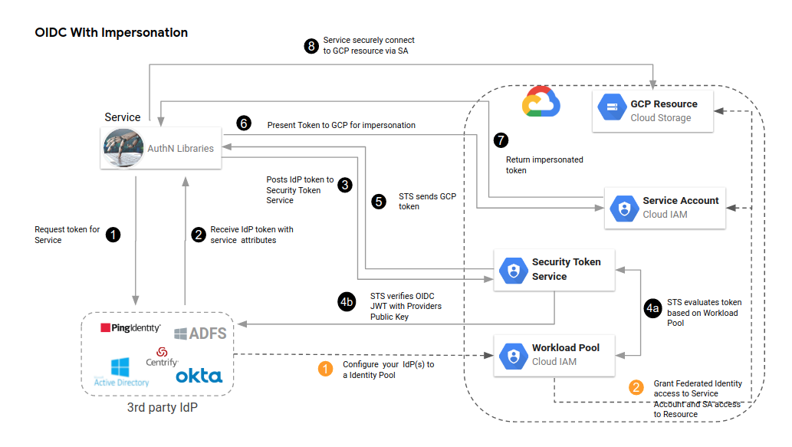

# GCP-Workload-Identity-Federation-Okta



This is a hands-on guide on how to use [workload identity federation with Okta](https://cloud.google.com/iam/docs/workforce-sign-in-okta) and can we extended to other
identity providers that support OpenID Connect (OIDC) or SAML identity provider (IdP).

If your application runs on-premises or on another cloud provider, then you can't attach a service account to the underlying compute resources. However, the application might have access to environment-specific credentials detailed [here](https://cloud.google.com/iam/docs/best-practices-service-accounts#use-workload-identity-fed).

By setting up workload identity federation, you can let these workloads obtain environment-specific short-lived credentials.
which Workloads can use these short-lived credentials to access
GCP APIs.

Using workload identity federation can help you
[reduce the number of credentials that require rotation](https://cloud.google.com/iam/docs/best-practices-for-using-workload-identity-federation#reduce-number-of-credentials)

## Best Practices for Service Accounts

* Allow naming and documentation conventions.
* Create single purpose service accounts.
* Follow Principle of least privilege while associating IAM roles.
* Rotate service account keys often.
* Disable unused service accounts ([Find Unused Service Accounts](https://cloud.google.com/policy-intelligence/docs/service-account-insights)) before deleting them.
* Also please refer [best-practices-for-managing-service-account-keys](https://cloud.google.com/iam/docs/best-practices-for-managing-service-account-keys)


## Prepare your external IdP

> Key Point: You only need to perform these steps once per IdP.

Before you begin, verify that your external IdP meets the following requirements:

*   OIDC

    +   The IdP supports OpenID Connect 1.0.

    +   The IdP's [OIDC metadata](https://openid.net/specs/openid-connect-discovery-1_0.html#ProviderMetadata)
        and JWKS endpoints are publicly accessible over the internet.

        GCP uses these endpoints to download your IdP's key set and
        uses this key set to validate tokens.

*   SAML

    +   The IdP supports SAML 2.0.

    +   The IdP provides a [SAML SP metadata document](https://www.oasis-open.org/)
        that describes the SAML service provider configuration and contains the
        IdP's signing certificate.

        GCP uses this certificate to validate SAML assertions and
        responses.

If your IdP meets these criteria, do the following:

*   OIDC (<mark>We will be using this in the DEMO</mark>)

    Configure Okta IdP so that your workload can obtain ID tokens
        
         * Create a Authorization Server on Okta Side
            1. Login to Okta admin console
            2. Go to Security->API
            3. Authorization Server
            4. Define a new authorization server , note the issuer URL — 
               you’ll need this to configure OIDC provider in Google Cloud 
               and in the example code.
            5. Set audience (could be anything that is mutually verifiable, 
               preferably unique), note the audience — you’ll need this to 
               configure OIDC provider in Google Cloud
            6. Define a new scope, set this scope as a default scope
            7. Define a new claim. Customize this claim to your requirement 
               of attribute verification in Google Cloud
            8. Go to access policies, make sure its Assigned to “All 
               Clients”
         
         * Create a WebApp on Okta Side

            1. In the Okta Admin Console,Go to Applications > Applications.
            2. Click Create App Integration.
               Select OIDC - OpenID Connect as the Sign-in method.
            3. Select Web Application as the Application type, then click 
               Next.
            4. Specify the App integration name.
            5. Grant Type:- Client Credentials
            6. Controlled access:- Allow everyone in your organization to access
            7. Save
            8. Fetch Client ID and Client Secret, Which we will use in HTTP
               Post Call.

    Note: Workload identity federation doesn't support opaque tokens or
    [token introspection](https://datatracker.ietf.org/doc/html/rfc7662)


*   SAML

    Please follow the steps in [Configure workforce identity federation with Okta and sign in users](https://cloud.google.com/iam/docs/workforce-sign-in-okta)


## Configure workload identity federation

> Key Point: You only need to perform these steps once per IdP. You can then use
the same workload identity pool and provider for multiple workloads and across
multiple GCP projects.

To start configuring workload identity federation, do the following:

It's best to
use a [dedicated project to manage workload identity pools and providers](https://cloud.google.com/iam/docs/best-practices-for-using-workload-identity-federation#dedicated-project)

1. Clone the `Git Project` (Preferably on [Cloud Shell Terminal](https://cloud.google.com/shell))

    <pre>
    git clone https://github.com/skpathak2/GCP-Workload-Identity-Federation-Okta.git
    </pre>

2. Navigate to `gcpwif.sh`

    <pre>
    cd GCP-Workload-Identity-Federation-Okta/scripts 
    </pre>

3. Update the Following `variables` in the `gcpwif.sh`
    ```
    vim gcpwif.sh

    issuer="<Okta App Url>" 
    region="<GCP region>"
    audience="<Okta Audience>"
    srvcacct="<GCP IAM Service Account Name>"
    accountid="<GCP Project Account ID>"
    wrkldidpoolname="<GCP Workload ID Pool Name>"
    projid="<GCP Project ID>"
    ```

    Example Below
    ```
    issuer="https://abc-67254.okta.com/oauth2/aus7d7agsfgasXe" 
    region="us-central1"
    audience="api://gcpapp20"
    srvcacct="oktaact"
    accountid="754548461"
    wrkldidpoolname="workload-okta-pool"
    projid="demo-sandbox"
    ```


4. Run the Script  `gcpwif.sh`
    ```
    bash gcpwif.sh
    ```

    This will setup following inside your GCP project
    
    +  Create workload-identity-pools 
    +  Define an attribute mappings


        The OIDC tokens or SAML assertions issued by your IdP might contain multiple attributes,
        and you must decide which attribute you want to use as subject identifier
        (`google.subject`).

        Optionally, you can [map additional attributes](https://cloud.google.com/iam/docs/workload-identity-federation#mapping).
        You can then refer to these attributes when granting access to resources.

        *   OIDC (<mark>This is by default configured in Okta Application Please Skip to ""</mark>)

            Your attribute mappings can use the claims embedded in the ID token or
            access token issued by the external IdP.

            You must map one of these claims to `google.subject` to uniquely identify
            the user. To protect against spoofing threats, choose a claim with a unique
            value that can't be changed.

            Many IdPs populate the `sub` claim with a unique and immutable
            ID. For these IdPs, consider mapping the `sub` claim to
            `google.subject`:

            ```
            google.subject=assertion.sub
            ```

            Avoid using a claim like `email` for this purpose. Email addresses
            can typically be reassigned or changed, so they don't uniquely and permanently
            identify a user.

        *   SAML
            
            Refer [Configure workforce identity federation with Okta and sign in users](https://cloud.google.com/iam/docs/workforce-sign-in-okta)

    + Create IAM service account and Assign Roles for external workload to consume.

> Note: `gcloud` commands sourced from [google-auth-library-java repo](https://github.com/googleapis/google-auth-library-java)

## Authenticate a workload.

> Key Point: You must perform these steps once per workload per cred time to live.

In this demo we will use a `Python` and `Java` based code located under `examples folder` which uses `google-auth` and `Cloud Client` Libraries.

Credits:- Python Script is based on the ove provided under [Google Cloud Workload Identity Federation with Okta](https://medium.com/google-cloud/google-cloud-workload-identity-federation-with-okta-90c05b985b17)


### Create a credential configuration

The [Cloud Client Libraries](https://cloud.google.com/apis/docs/cloud-client-libraries), gcloud cli and Terraform, can automatically obtain external credentials,
and use these credentials to impersonate a service account. To let libraries and tools
complete this process, you have to provide a credential configuration file. This file
defines the following:

*   Where to obtain external credentials from
*   Which workload identity pool and provider to use
*   Which service account to impersonate


+   **File-sourced credentials**: The libraries read the external credential
    from a local plain text or JSON file(<mark>We will use this in the Demo</mark>). For example:

    *   JSON 

        <pre>
        {
          "mytoken": "ey...
        }
        </pre>


    The external credential can be:

    +    an OIDC token
    +    a SAML response
    +    a base64-encoded SAML assertion

    You must periodically update the file so that it always contains a valid
    credential. For example, if the OIDC token or SAML assertion is valid for
    one hour, you must refresh the file at least once every hour.

+   **URL-sourced credentials**: The libraries perform a `GET` request to
    an HTTP endpoint whenever they need a new credential. The endpoint must
    return a plain text or JSON response that is equivalent to the format used
    by file-sourced credentials.

> Note: Unlike a `service account key`,
a credential configuration file doesn't contain a private key and doesn't need
to be kept confidential. Details about the credential configuration file are
available at [here](https://google.aip.dev/auth/4117).


To create a credential configuration file, do the following:

*   File-sourced credentials (<mark>We will use this in this Demo</mark>)

    <pre >
    gcloud iam workload-identity-pools create-cred-config \
        projects/<var>PROJECT_NUMBER</var>/locations/global/workloadIdentityPools/<var>POOL_ID</var>/providers/<var>PROVIDER_ID</var> \
        --service-account=<var>SERVICE_ACCOUNT_EMAIL</var> \
        --output-file=<var>FILEPATH</var>.json \
        --credential-source-file=<var>TOKEN_FILEPATH</var> \
        --credential-source-type=<var>SOURCE_TYPE</var> \
        --credential-source-field-name=<var>FIELD_NAME</var>
    </pre>

Also detailed in [accessing-resources-from-an-oidc-identity-provider](https://github.com/googleapis/google-auth-library-java#accessing-resources-from-an-oidc-identity-provider)


### Using the credential configuration to access

To let tools and client libraries use your credential configuration, do the
following:

1.  Initialize an environment variable `GOOGLE_APPLICATION_CREDENTIALS` and point
    it to the credential configuration file:

    <h4 class="showalways">Bash</h4>
    <pre>
      export GOOGLE_APPLICATION_CREDENTIALS=`pwd`/<var>FILEPATH</var>.json
      </pre>
      where <code><var>FILEPATH</var></code> is the relative file path to the
      credential configuration file.


    <h4 class="showalways">PowerShell</h4>

      <pre>
      $env:GOOGLE_APPLICATION_CREDENTIALS = Resolve-Path '<var>FILEPATH</var>.json'
      </pre>
      where <code><var>FILEPATH</var></code> is the relative file path to the
      credential configuration file.


2.  Use a client library or tool that supports workload identity federation and can
    [find credentials automatically](https://cloud.google.com/docs/authentication/client-libraries):


### Run the sample code

1. Navigate to `examples` directory
```
cd GCP-Workload-Identity-Federation-Okta/examples
```

2. Select the directory `Python` or `Java` based on your use case updates the variables and run/compile the code.


## Next Steps

Read more about Workload Identity Federation [here](https://cloud.google.com/iam/docs/workforce-identity-federation#whats_next)
